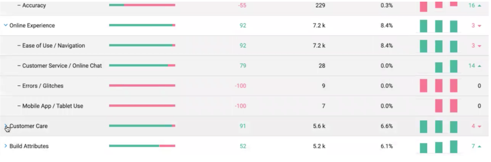
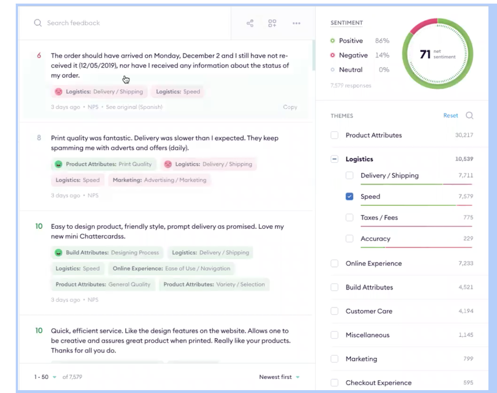

# Backend Engineer Interview

## You’re tasked with building APIs to power two views:

1.  ### Pulse

    The first page is a collection of topics (ex: Online Experience). The topics are composed of different themes (ex: Ease of Use/Navigation). As shown in the images below, each topic has some metadata associated with it like sentiment, num of mentions etc.
    

    On clicking a topic, a list of themes inside that topic opens up. Themes have the same metadata as the topic. On clicking the topic, the topic analysis page opens up.

    

2.  ### Topic Analysis

    There are 4 panes in this view.

    1.  Feedback Viewer: Each feedback has the following attributes:
        1. Text
        2. List of Topics + Themes
        3. Score (6,8,10,10) etc
        4. Date
    2.  Net Sentiment Score: For the selected theme, calculate the net sentiment (pos sentiment - neg sentiment). Show the number of responses filtered as well.
    3.  Theme Selector:
        1. Checkboxes to select different themes. Selecting a topic, selects all themes in it. This modifies the feedback viewer and net sentiment score panes.
        2. A search button to find topics/themes.
        3. A reset button to reset back to the theme with which the page was opened.
        4. Against each theme/topic show #mentions and sentiment bar.
    4.  Pagination and sorting:
        1. Paginate across the feedbacks
        2. Sort by date, highest sentiment, lowest sentiment etc.

    

### Evaluation Criteria

1.  Features implemented
2.  API design & Data modelling
3.  Robustness of code - patterns used/tests/comments etc

### Things to note

1.  Whatever it takes to ensure a frontend developer can develop those two views - lies in the purview of the assignemnt. Some of the features might be best left on the client, some on the server.
2.  Push your code in this repo. Work like how you would work in a real life setting, breaking things into commits, adding tests, proper low level design etc.
3.  We’ve intentionally left quite a few things vague and ambiguous to replicate the real environment.
4.  We’d recommend using golang but it's your choice.
5.  Put your code in the folder `src`.
6.  Feel free to leave stubs in case you're short on time.
7.  Sample data is present in `data`. The API can work off of in-memory database. Do note: in the sample data, there is a 1:1 mapping between theme and topic. Please keep your implementation independent from this fact. A topic can have multiple themes in it.
8.  This is more of a LLD assignment. On the call, we will go over HLD of this.
